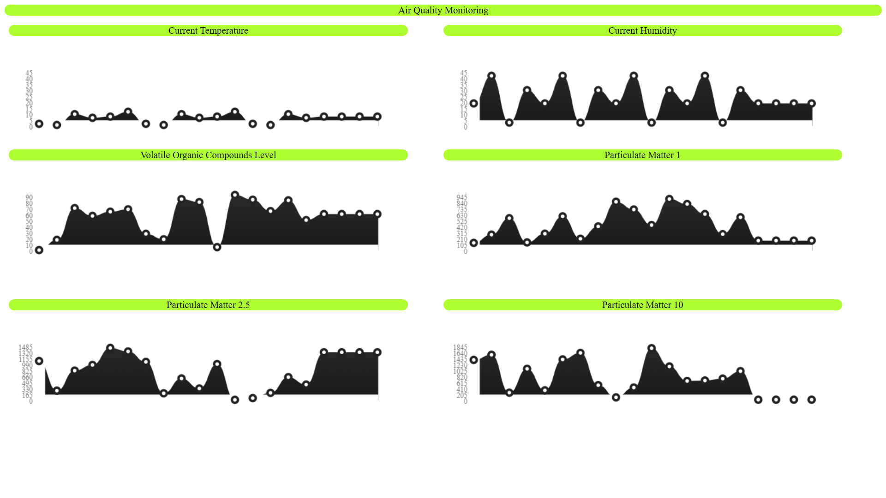

# IoT Server
This repository contains all files for a server to recive, store and show information from an edge in a IoT pipeline. 

The server is planned to connect to a SQLite database to store the data.

The server works deploying a Docker container. And launching the server in it, using the port `8080`.

Where here we can see an example of the frontend:


## Installation Guide
To deploy the server, exectue the following command in a bash console, in the directory containing this repository:

````bash
bash deploy_container.sh
````

If the machine does not have Docker, you can install it executing the following command in a bash console, in the directory containing this repository:

````bash
bash install_docker.sh
````

To get the repository into the machine, simply execute the following command in a bash console:

````bash
git clone https://github.com/NIU1638962/iot-server
````

Alternatively, create a `server.sh` file, paste the following code:

````bash
#!/bin/bash

echo "Preparing environment."
if [ -d "iot-server" ];
then
    echo "Directory already exists. Removing."
    rm -d -f -r iot-server
    echo "Directory removed."
fi

if command -v git > /dev/null 2>&1; then
    echo "Git is already installed."
else
    echo "Git is not installed. Installing git."
    sudo apt-get update -y
    sudo apt-get install -y git
    echo "Git has been installed."
fi

echo "Cloning repository with the server infrastructure."
git clone https://github.com/NIU1638962/iot-server
echo "Repository cloned."

echo "Setting working directory."
cd iot-server
echo "Working directory set."

echo "Execute install docker."
bash install_docker.sh
echo "Environment prepared."

echo "Execute deploy."
bash deploy_container.sh
````

and execute the following command in a bash console:

````bash
bash server.sh
````

and all the steps needed will be performed automatically and the server will be deployed.

## Contents
### `install_docker.sh`
Bash shell script that detects if Docker is installed in the machine, if it is not, installs it using `apt-get`.

### `deploy_container-sh`
Bash shell script that deploys the container with the server. 

In it's process, it runs `build_container.sh` and `run_container.sh`.

### `build_container.sh`
Bash shell script that builds a new docker image with the name `server` and the tag `latest`, from the Dockerfile.

### `Dockerfile`
The container is based upon a basic `Linux` OS with `Python 3.11` installed, called `python:3.11-alpine`.

We set up the `HOME` directory of the container as `/root`, create a directory `/server` and set this one as the working directory from now on.

We copy the file `requirements.txt` into this directory and run `pip install -r requirements.txt` to intall all the dependecies of Python that is used by our server.

We proceed to copy all the necessary files into the `/server` folder, this includes: `server.py` (Python script with the HTTP server), `database.py` (Python script with the SQLite database) and `airQ.db` (the SQLite database with the shape of the tables used in it).

Following up, we make another directory, `/server/public`, were we copy the files: `index.html` (HTML file with the WebPage to visualize the data of our server) and `Lyne.js` (a JavaScript file to visualize our graphs dynamically).

Lastly, we give permission to the file `server.py` to be executed, expose the port `8080` and create the entrypoint to the container that will be executing with Python 3, the file `server.py`.

### `requirements.txt`
Text file with all the python dependencies of our server so `pip` can install them in the container.

### `server.py`
Python script with the HTTP server. It binds to `0.0.0.0` and the port `8080`. Logs into `stdout` all information of the server, like the deployment of it, the request gotten, when and from what IP, the errors, etc. The logging level cna be changed, by default is `INFO`.

The server has:
 - `/`: the home page that shows the realtime graphs of data. 
 - `/get-data`: Page that retrives all air data from the database for the graphs or to locally download it.
 - `/Lyne.js`: Script for the real-time graphs.
 - `/favicon.ico`: For the browser request icons.

Any other page will redirect to the home page.

It aslo accpets the data from the edge device and sents it into the Database.

### `database.py`
Python script with the SQLite database connection. It handles the request of retriving data made by the server and the request of saving data also made by the server when it reives it from the edge device.

It also logs in debug mode the data transfered. The level of logging visualized is controlled by `server.py` since it is the one calling the database.

### `airQ.db`
Is the file where the SQLite database is stored. SQLite is a light SQL database used in devices. Allows it to be protable and not using much space. It comes with the tables already created so the Database only needs to handle data transfers.

It has only one table called `airq` with 6 collumns:
- `temp`: Stores float representing the temperature.
- `hum`: Stores float representing the humidity.
- `voc`: Stores float representing the volatile organic compounds level.
- `pm1`: Stores float representing the particle matter 1.
- `pm25`: Stores float representing the particle matter 2,5.
- `pm10`: Stores float representing the particle matter 10.

### `index.html`
Basic Hyper Text Markup Language File, with a simple frontend showing a real-time graphs of air monitoring that refreshes every 5 seconds.

### `Lyne.js`
JavaScript file that shows in realtime line graphs for webpages.

Made by [Mathew Kurian](https://github.com/mathew-kurian/Lyne.js).

### `run_container.sh`
Bash shell script that runs the container with the server, binds the container `8080` port to the host's `8080` port, the container is named `server`. 

In it's process, it runs `delete_container.sh` to delete any container created before with the same name.

### `delete_container.sh`
Bash shell script that searches if there is any container named `server` that has been stopped (status `exited`), and if there is, remove it.

In it's process, it runs `stop_container.sh` to stop any container that is running with the same name.

### `stop_container.sh`
Bash shell script that searches if there is any container named `server` that is running (status `running`), and if there is, stop it.